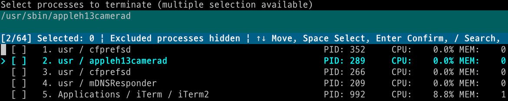

# Process Killer

A clean CLI tool for process management

## Features

- Various sorting options (CPU, memory, uptime, etc.)
- Process search functionality
- Clean interface using rich
- Fast dependency management via uv
- Safe process termination (SIGTERM → SIGKILL)

## Screenshot



## Installation and Usage

```bash
# Install dependencies
uv sync

# Run method 1: Using script (recommended)
./psk

# Run method 2: Direct execution
uv run psk run

# Show help
./psk --help
```

## Usage

1. Select sorting method
   - General (CPU + Memory)
   - Memory usage
   - CPU usage
   - Uptime (oldest first)
   - Zombie processes
   - Process search

2. Select processes to terminate by number (comma-separated or range, e.g., 1,3,5 or 1-5)
3. Confirm and terminate processes
