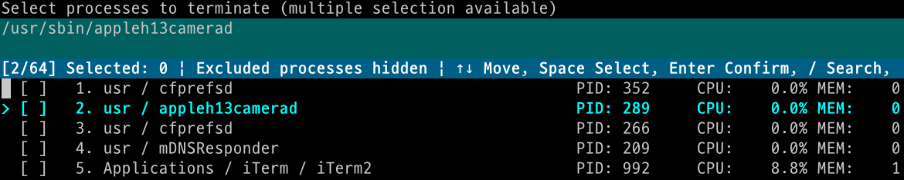

# Process Killer

A clean CLI tool for process management

## Features

- Various sorting options (CPU, memory, uptime, etc.)
- Process search functionality
- Clean interface using rich
- Fast dependency management via uv
- Safe process termination (SIGTERM → SIGKILL)

## Screenshot



## Installation and Usage

```bash
# Install dependencies
uv sync

# Run method 1: Using script (recommended)
./psk

# Run method 2: Direct execution
uv run psk run

# Show help
./psk --help
```

## Usage

1. Select sorting method
   - General (CPU + Memory)
   - Memory usage
   - CPU usage
   - Uptime (oldest first)
   - Zombie processes
   - Process search

2. Select processes to terminate by number (comma-separated or range, e.g., 1,3,5 or 1-5)
3. Confirm and terminate processes

## Bulk kill by category (`psk kill`)

Terminate whole classes of processes at once instead of picking them one by
one. Run `psk kill` with no arguments for an interactive checkbox multi-select,
or pass categories directly for scripted, non-interactive use.

Categories:

- `zombie` — defunct (stat `Z`) processes; their parent is nudged (SIGCHLD) to reap them
- `lsp` — orphaned language servers (PPID 1): leaked serena / pyright / typescript / kotlin LSPs
- `gradle` — idle Gradle build / Kotlin compile daemons (CPU < 1%); they respawn on the next build
- `codex` — OpenAI Codex CLI processes that are orphaned (PPID 1) or ≥ 3 days old
- `claude` — Claude Code CLI processes that are orphaned (PPID 1) or ≥ 3 days old

`codex` / `claude` never match a recent, actively-driven session — only leaks
and long-stale processes.

```bash
psk kill                      # interactive: check categories, confirm
psk kill --list               # show categories and current match counts
psk kill -c lsp,gradle        # non-interactive, still confirms
psk kill -c lsp,zombie -y     # non-interactive, no prompt
psk kill -c gradle --dry-run  # preview only, kill nothing
psk kill -c codex,claude      # orphaned/stale only — review, then confirm
```

Termination is SIGTERM first, then SIGKILL for survivors. The running process
and its ancestors are always excluded, so `kill` can never terminate itself.

## Cleanup daemon (`psk daemon`)

Run a periodic background cleanup so leaks never accumulate. Installed as a
macOS LaunchAgent (`com.illb.psk-daemon`), it runs the safe set
(`zombie,lsp,gradle`) every 30 minutes and at login/boot. `codex` / `claude`
are intentionally excluded from the daemon — they are manual-only.

```bash
# install + load (runs at boot thereafter), and stop + remove:
./deploy/install-daemon.sh
./deploy/uninstall-daemon.sh

# status and recent cycles:
launchctl list | grep com.illb.psk-daemon
tail -n 20 ~/Library/Logs/psk-daemon.log

# run standalone (no launchd):
psk daemon --once                          # one cycle, then exit
psk daemon --interval 1800 -c zombie,lsp,gradle
```

Configure via env before install: `PSK_DAEMON_INTERVAL` (seconds),
`PSK_DAEMON_CATEGORIES` (comma-separated).

## Global skill

This project ships its own skill in `skill/SKILL.md`. Install it to let both
Claude Code and Codex drive `psk` via the `/psk` skill — it symlinks `skill/`
into `~/.claude/skills/psk` and `~/.codex/skills/psk`:

```bash
./deploy/install-skill.sh      # register for Claude + Codex
./deploy/uninstall-skill.sh    # remove
```

The skill is self-contained here (not part of any other skills repo), so
updating `skill/SKILL.md` updates the installed skill immediately.
